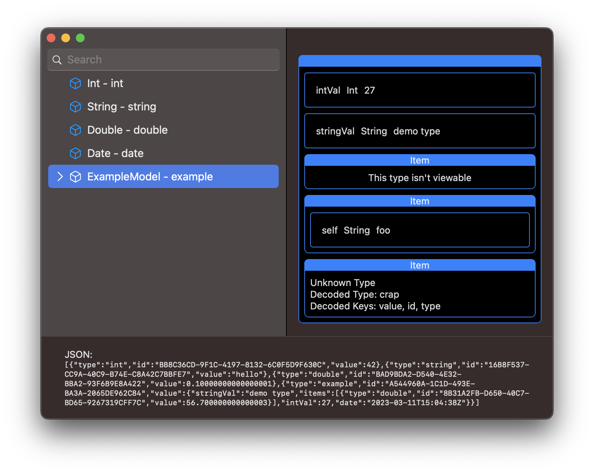

# TypeSupport

## Goals

The motivation behind this project was to try and provide a template for solving two common problems in a generic and (hopefully) relatively painless way. At a high level they are:

* Allow type identification such that we can decode / encode an arbitrary assembledge of data including its type and other identifying traits.
* Support for viewing a type including, and especially, those that are identified using the above mechanism.
 
More specifically, those two goals should not be dependent upon one another. Just because a type is identifiable doesn't necessarily mean it would be viewable and vice-versa. 

Adding this functionality to a type means conforming to a basic protocol, `IdentifiableType` and / or `ViewableType`. But there are some wrinkles, especially with regards to an `IdentifiableType` that require a bit more effort. Mainly incorporating that type into `AnyIdentifiable`. See the documentation in those items for additional details.

## What this isn't

This isn't a framework or package. It's meant to be more of a template for a fairly common problem. But there are too many varities of encoding to craft a solution that would satisy them all. At least not in a way that isn't messy.

#### Demo

